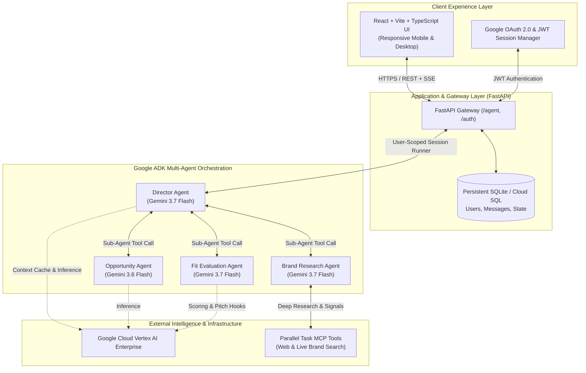

<div align="center">

# ✦ DealPilot

### Autonomous Creator Commercial & Deal Intelligence Platform
**Powered by Google Cloud Vertex AI & the Agent Development Kit (ADK)**

[](https://dealpilot-1051036456747.us-central1.run.app)
[](https://cloud.google.com/vertex-ai)
[](https://github.com/google/agent-development-kit)
[](https://reactjs.org/)
[](https://fastapi.tiangolo.com/)

[**Live Demo**](https://dealpilot-1051036456747.us-central1.run.app) • [**Architecture**](#-system-architecture) • [**Multi-Agent System**](#-multi-agent-system-deep-dive) • [**Local Setup**](#-getting-started-locally) • [**Deployment**](#-google-cloud-deployment)

---

</div>

## 📌 Executive Summary

Modern content creators generate immense commercial value, yet managing partnerships remains fragmented, chaotic, and manual. Creators spend countless hours researching brand sponsorship budgets, vetting product alignment, formulating pitch angles, and tracking outreach.

**DealPilot** is an autonomous AI-powered business and partnership copilot designed for creators. Built on **Google's Agent Development Kit (ADK)** and powered by **Gemini 3.7 Flash on Vertex AI**, DealPilot transforms raw market signals into high-converting brand partnerships. It autonomously monitors commercial opportunities, executes in-depth brand market research, evaluates creator-brand affinity with quantitative scoring, and drafts customized, win-win sponsorship pitch hooks.

---

## 🏛 System Architecture

DealPilot implements a hierarchical multi-agent architecture where a conversational **Director Agent** orchestrates three specialized sub-agents with dedicated tools, memory, and validation constraints.



---

## 🤖 Multi-Agent System Deep Dive

DealPilot utilizes Google's official **Agent Development Kit (ADK)** to compose an enterprise-grade agent team:

| Agent | Model | Primary Mission | Tools & Integrations |
| :--- | :--- | :--- | :--- |
| **Director Agent** | `gemini-3.7-flash` | Master orchestrator. Manages dialogue turn flow, creator intent classification, state persistence, and final synthesized delivery. | `save_creator_profile`, sub-agent delegation wrappers |
| **Opportunity Agent** | `gemini-3.6-flash` | Commercial signal detection. Identifies active affiliate campaigns, sponsored creators, and partnership windows matching creator niche. | Market signal analyzers, opportunity deduplication |
| **Brand Research Agent** | `gemini-3.7-flash` | In-depth brand intelligence. Extracts product catalogs, past creator collaborations, audience demographics, and company positioning. | **Parallel Task MCP Tools** (live search & web scraping) |
| **Fit Evaluation Agent** | `gemini-3.7-flash` | Algorithmic compatibility scoring (0–100). Analyzes brand safety, product synergy, audience overlap, and generates tailored pitch hooks. | Pydantic validation schema, quantitative fit engine |

### Agent Interaction Protocol
1. **Zero-Cold-Start Onboarding**: When a creator first enters, DealPilot ingests their profile (niche, platforms, follower scale, audience demographics) into persistent state.
2. **Autonomous Signal Discovery**: The creator browses vetted commercial opportunities or triggers discovery conversations.
3. **Two-Stage Intelligence Pipeline**:
   - **Research Phase**: Research must be conducted first to establish factual grounding.
   - **Fit Evaluation**: The Fit Agent runs against grounded brand research data and the creator's persistent profile to compute an objective affinity score and concrete pitch strategies.
4. **Transparent Thinking Indicator**: The frontend visually streams each agent step (analysis, MCP search, synthesis) so the user always has real-time insight into the decision pipeline.

---

## ✨ Key Capabilities

- **🎯 Curated Commercial Signals**: Real-time opportunity feed showing active brand sponsorship programs with confidence levels and "Why You / Why Now" rationale.
- **🔍 Deep Brand Due Diligence**: Automated extraction of company overview, recent product launches, marketing focus, and creator partnership tracks.
- **📊 Quantitative Fit Scoring**: Compatibility scores out of 100 with breakdown across Audience Affinity, Brand Safety, Content Synergy, and Value Alignment.
- **💬 Conversational Deal Desk**: Natural language chat interface allowing creators to ask follow-up questions, request customized pitch emails, and explore contract negotiation terms.
- **🔐 Enterprise Security & Zero-Trust Sessions**:
  - Google OAuth 2.0 One-Tap / Identity Services integration.
  - User-isolated conversation sessions persisted via SQLAlchemy.
  - JWT authorization ensuring zero cross-tenant state leakage.
- **📱 Responsive Mobile-First Design**: Optimized for mobile and desktop screens with sticky navigation, touch-friendly cards, and adaptive dark/light themes.

---

## 🛠 Tech Stack Matrix

```
 dealpilot/
 ├── agent.py                     # Google ADK Director Agent definition
 ├── workflow.py                  # Multi-agent session runner & DB binding
 ├── agent_api.py                 # FastAPI endpoints for chat, opportunities, research & fit
 ├── database.py                  # Async SQLAlchemy models & persistence layer
 ├── logging_config.py            # Structured logging configuration
 ├── run_agent.py                 # Application entrypoint & CLI runner
 ├── Dockerfile                   # Multi-stage production container build
 ├── opportunity_agent/           # Opportunity discovery specialist agent
 ├── brand_research_agent/        # Brand intelligence agent + Parallel MCP tools
 ├── fit_agent/                   # Partnership compatibility scoring agent
 ├── auth/                        # JWT authentication & Google OAuth handlers
 └── frontend/dealpilot-ui/       # React 18 + Vite + TypeScript application
```

- **LLM Foundation**: Google Gemini 3.7 Flash & 3.6 Flash via **Vertex AI Enterprise**.
- **Agent Framework**: Google Agent Development Kit (`google-adk`).
- **Backend**: FastAPI, Uvicorn, SQLAlchemy Async, SQLite / Cloud SQL, Pydantic v2.
- **Frontend**: React 18, Vite, TypeScript, CSS Custom Properties (Theme Engine).
- **Deployment**: Google Cloud Run (Fully Managed Serverless Container).
- **Containerization**: Multi-stage Docker (Node.js 20 build stage + Python 3.11 slim runtime).

---

## 🚀 Getting Started Locally

### Prerequisites
- **Python**: `3.11+`
- **Node.js**: `20+` with `npm`
- **Google Cloud SDK**: `gcloud` CLI authenticated with Vertex AI access

### 1. Clone & Environment Configuration
```bash
git clone https://github.com/your-username/dealpilot.git
cd dealpilot
```

Create a `.env` file in the root directory:
```env
GOOGLE_GENAI_USE_ENTERPRISE="TRUE"
GOOGLE_CLOUD_PROJECT="your-gcp-project-id"
GOOGLE_CLOUD_LOCATION="us"
PARALLEL_API_KEY="your-parallel-api-key"
DEALPILOT_JWT_SECRET="generate-a-secure-random-secret"
DEALPILOT_MODEL="gemini-3.7-flash"
DEALPILOT_FIT_MODEL="gemini-3.7-flash"
DEALPILOT_OPPORTUNITY_MODEL="gemini-3.6-flash"
```

### 2. Authenticate Google Cloud Application Default Credentials
```bash
gcloud auth application-default login
gcloud config set project your-gcp-project-id
```

### 3. Backend Setup
```bash
python3 -m venv .venv
source .venv/bin/activate
pip install -r requirements.txt
```

### 4. Frontend Build
```bash
cd frontend/dealpilot-ui
npm install
npm run build
cd ../..
```

### 5. Launch Application
```bash
uvicorn run_agent:app --reload --port 8000
```
Open **`http://localhost:8000`** in your browser to start using DealPilot.

---

## ☁️ Google Cloud Deployment

DealPilot is packaged as a multi-stage Docker container optimized for **Google Cloud Run**. Because Cloud Run is a stateless container environment, DealPilot uses an automatic **Cloud Storage Persistence Bridge** (`gcs_persistence.py`) to keep SQLite data, users, and conversations 100% persistent across redeployments and restarts.

### 1. Create a Cloud Storage Bucket for Persistence
```bash
PROJECT_ID=$(gcloud config get-value project)

# Create bucket in the US multi-region
gcloud storage buckets create gs://${PROJECT_ID}-dealpilot-data --location=US
```

### 2. Grant IAM Roles
Grant the Cloud Run service account access to Vertex AI and the persistence bucket:
```bash
PROJECT_NUMBER=$(gcloud projects describe ${PROJECT_ID} --format="value(projectNumber)")

# Grant Vertex AI user access
gcloud projects add-iam-policy-binding ${PROJECT_ID} \
  --member="serviceAccount:${PROJECT_NUMBER}-compute@developer.gserviceaccount.com" \
  --role="roles/aiplatform.user"

# Grant Cloud Storage Object Admin for persistent database sync
gcloud projects add-iam-policy-binding ${PROJECT_ID} \
  --member="serviceAccount:${PROJECT_NUMBER}-compute@developer.gserviceaccount.com" \
  --role="roles/storage.objectAdmin"
```

### 3. Deploy to Cloud Run
```bash
gcloud run deploy dealpilot \
  --source . \
  --region us-central1 \
  --platform managed \
  --allow-unauthenticated \
  --memory 2Gi \
  --cpu 2 \
  --timeout 300 \
  --min-instances 1 \
  --max-instances 1 \
  --set-env-vars \
GOOGLE_GENAI_USE_ENTERPRISE="TRUE",\
GOOGLE_CLOUD_PROJECT="${PROJECT_ID}",\
GOOGLE_CLOUD_LOCATION="us",\
PARALLEL_API_KEY="your-parallel-api-key",\
DEALPILOT_GCS_BUCKET="${PROJECT_ID}-dealpilot-data",\
DEALPILOT_JWT_SECRET="dealpilot-production-super-secret-key-2026"
```
> [!NOTE]
> - `DEALPILOT_GCS_BUCKET`: Enables automatic startup restore and continuous backup of `dealpilot.db`.
> - `DEALPILOT_JWT_SECRET`: Uses a static persistent secret so existing user logins remain valid across redeploys.
> - `--min-instances 1 --max-instances 1`: Keeps the service always warm and ensures single-instance SQLite consistency.

---

## 🔒 Security & Privacy

- **Tenant Isolation**: Every conversation session, research report, and opportunity record is partitioned by authenticated user ID.
- **Strict OAuth Origin Compliance**: Google Identity Services enforce cryptographic token validation with registered JavaScript origins.
- **Stateless Cloud Run Runtime**: Secrets and session keys are injected via environment variables; database tables initialize idempotently on startup.

---

## 🏆 Hackathon Highlights

- **Native Google ADK Integration**: One of the earliest production showcases of Google's new Agent Development Kit orchestrating multi-agent stateful workflows.
- **Gemini 3.7 Flash Multi-Agent Coordination**: Demonstrates high-speed reasoning, context-cached inference, and tool execution.
- **Model Context Protocol (MCP)**: Leverages Parallel Task MCP tools for grounding agent research in real-time web intelligence.
- **Production-Grade Delivery**: Fully containerized, live on Cloud Run, complete with mobile-responsive UI, database persistence, and OAuth 2.0 authentication.

---

<div align="center">
Built with 💙 for the Google Cloud Hackathon.
</div>
